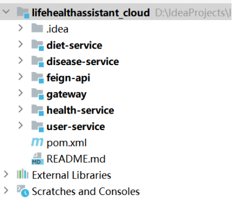
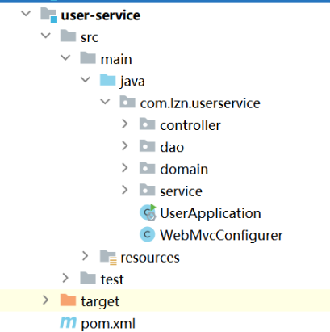

# lifehealthassistant_cloud
### 该系统是生活健康助手的服务器端的微服务版本。相较于SpringBoot版本，在功能上并没有什么改进，而是使用SpringCloud进行了重新架构。
## GitHub地址：
### 服务器端(本项目)地址为  https://github.com/genuinelv/lifehealthassistant_cloud
### 服务器端（老项目，boot版）地址为 https://github.com/genuinelv/lifehealthassistant_boot
### 客户端（Android）地址为  https://github.com/genuinelv/lifehealthassistant_android
## 相关配置  
### IDEA版本为2022.3.3
### 使用的Java1.8  
### Maven版本为3.6.0
### SpringBoot版本为2.3.9.RELEASE
### Nacos版本为1.4.1
### Mysql数据库版本为8
## 运行
### 导入依赖后，建数据库health_project_data，字符集为utf8。建好数据库后运行initAssistant.sql文件，创建user表和useremail表
### 运行nacos
### 更改user-service,diet-service，disease-service,health-service模块下的application.yml中的数据库用户名和密码
### user-service模块下的application.yml内填入自己的邮箱和授权码，用以支持绑定邮箱操作
### 在D盘下创建pic_user,pic_diet,pic_disease文件夹存储图片
## 界面展示，见Android端
## 附项目截图
 
 
 
 

